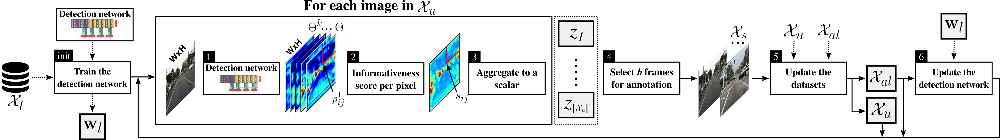

# 1. Active Learning for Deep Detection Neural Networks
---
This repository provides codes for reproducing the results in the following paper:
    
    @article{HHA2019,
        title = {Active Learning for Deep Detection Neural Networks},
        author = {Hamed H. Aghdam, Abel Gonzalez-Garcia, Joost van de Weijer, Antonio M. Lopez},
        booktitle = {Proceedings of International Conference on Computer Vision},
        year = {2019}
   }

 

Our method for active learning of object detectors starts with a detector trained on a labeled dataset. Then, active learning cycles are repeated according to a preset budget. Each cycle starts by computing dense object prediction probabilities for each remaining unlabeled image. This is followed by computing pixel-level scores and aggregating them into a frame-level score. These scores are used to automatically select images for human labeling. Finally, the original detector is finetuned using the accumulated actively-labeled images.

## 2. Dependencies:
---
* Python 2.7
* Tensorflow > 1.10
* H5Py
* Numpy > 1.12
* OpenCV 3.X
* Matplotlib
* Ubuntu > 16 (not tested on other platforms)

## 3. Datasets
---
We have used [CityPerson](https://bitbucket.org/shanshanzhang/citypersons/src/default/), [CityScape](https://www.cityscapes-dataset.com/), [Caltech Pedestrain](http://www.vision.caltech.edu/Image_Datasets/CaltechPedestrians) and [BDD100K](https://bair.berkeley.edu/blog/2018/05/30/bdd/) datasets in this paper.
You may download them from the provided links. 

### 3.1 How to use the datasets
Create a folder on your disk and copy the above dataset into this folder. Then, __change__
the value of "DS_ROOT_DIR" in [datasources.py](image_datasets/datasources.py#L21) to this folder. Unless you change the codes in this file,
it expects the following structure:

    DS_ROOT_DIR >
                |-CityScape >
                |           |-leftImg8bit >
                |           |             |- train
                |           |             |- val
                |           |-anno_train.mat
                |           |-anno_val.mat
                |-Caltech_Pedestrian >
                |                    |-data >
                |                           |-annotations
                |-BDD100K >
                |         |-bdd100k >
                |                  |-images
                |                  |-labels


The data source for Caltech_Pedestrain stores the whole dataset (encoded image strings) in the memory (RAM). Depending on
the free memory, your system may run out of memory. To alleviate this, you can run the following commands to store the whole dataset in an H5 file.

```python   
c = CaltechPedestrian(['set01', 'set02', 'set03', 'set04', 'set05'], step=1, skip_empty_frames=True, acceptable_labels=['person', 'people'])
c.write_to_h5('DS_ROOT_DIR/Caltech_Pedestrian/train.h5py')

c = CaltechPedestrian(['set06', 'set07', 'set08', 'set09', 'set10'], step=10, skip_empty_frames=True, acceptable_labels=['person', 'people'])
c.write_to_h5('DS_ROOT_DIR/Caltech_Pedestrian/val.h5py') 
```
Alternatively, you can execute [generate_h5.py](scripts/generate_h5.py) for generating H5 files for training, evaluation and active learning purposes. 
Note, however, that the train.h5py file is only used to training the network and finding the lower-bound of the error and it is not used to perform
active learning.  
# 4. How to Run?
---
**IMPORTANT NOTE**: Our evaluation functions and metric as well as the loss function are implemented for the __pedestrian detection problem__
which is a binary detection problem. _For multi-class detection problems, you will need to modify them_.

We have provided three different scripts for [training](scripts/train.py), [evaluating](scripts/evaluate.py) and performing [active learning](scripts/active_learn.py) inside the folder 
[scripts](scripts). You may not need to run the train.py script since we have already provided the weights of our network 
trained on the CityPerson (ie. CityScape with pedestrian annotations) dataset.

We profile our network at certain points during training which depends on **libcupti**. Make sure your add the directory
containing **libcupti** to the ```LD_LIBRARY_PATH``` environment variable. In Linux/Ubuntu, you may run
    
    locate libcupti 

in the terminal to find the directory containing **libcupti** and add it to the environment variable by executing:

    export LD_LIBRARY_PATH=$LD_LIBRARY_PATH:PATH_TO_LIBCUPTI_DIR

 
## 4.1 Training
You may run [train.py](scripts/train.py) to train the network on one of the above datasets. The script accepts the 
following optional command-line arguments. 

    --dataset: Dataset used for active learning. Default='caltech'. choices=['caltech', 'bdd', 'cityperson']
    --uncertainty_method: The method used for computing the uncertainty. Default: mutual_info. choices=['mutual_info', 'entropy', 'mcdropout']
    --neg2pos: The negative to positive ratio. Default: 15
    --logdir: Directory to store log files", default='/home/{}/Desktop/'.format(os.environ['USER']))
    --gpu: The index of GPU for running the code. Default: '0'
    --restore_from: Path to pretrained weights.", default='network/pretrained_weights/cityperson'
    --current_iter: Current iteration. This is used to continue training form a checkpoint

As it turns out, running

```
python scripts/train.py 
```

will train a network on the Caltech Pedestrian dataset with N2P of 15 by initializing the network using the weights
trained on the CityPerson dataset. 

*NOTE*: If you get an error message similar to

    ImportError: No module named network.models.fireresidual_detection

make sure that you have added the root directory of the project to your PYTHONPATH using the _export_ command. If you
have already changed your directory to the root directory of the project, you may execute
```
    export PYTHONPATH=`pwd`
``` 
in Linux/Ubuntu for this purpose.

## 4.2 Active Learning
You may run [active_learn.py](scripts/active_learn.py) to perform active learning on one of the above datasets. The
script accept the following optional arguments:

    --dataset: Dataset used for active learning. Default='caltech'. choices=['caltech', 'bdd']
    --budget: The budget of active learning at each cycle. Default=500
    --uncertainty_method': The method used for computing the uncertainty. Default: mutual_info. choices=['mutual_info', 'entropy', 'mcdropout']
    --uncertainty_aggregation': The method used for aggregating uncertainty scores. This could be only max_pool". choices=['max_pool']
    --selection_method': Sample selection method. Default: top_best. choices=['top_best', 'tournament']
    --update_rule: Training method. Default: momentum. choices=['momentum', 'rms']
    --restore_from: Path to pretrained weights. Default='network/pretrained_weights/cityperson/cityperson
    --gpu: The index of GPU for running the code. Default: '0'
    --use_temporal_coherence': Weather or not to use temporal coherence. Default: True
    --apply_selection_trick': Weather or not to apply selection rules. Default: True
    --dropout_keep_prob: Dropout keep probability. Default=0.8

Most of the above parameters are specific to our method. We encourage you to read the paper before actually trying the method.
Running

```
python scripts/active_learn.py
```

will perform active learning on the Caltech Pedestrian dataset with per-cycle budget 500 using mutual information as the
scoring function and sum of max pooled scores as the aggregation function. It will also apply the selection rules described
in the paper and use temporal coherence to perform the selection.

We have used a descriptive name for the log directory. You may change the variable [log_dir](scripts/active_learn.py#L129) 
to your desired name. Also, the N2P is hard-coded in this script and we fixed it to 15.

Even though it is possible to restore the active learning procedure from a specific iteration, we highly recommend to
run this script once and from scratch. This could take a couple of days to perform 14 active learning cycles depending on your device.

## 4.3 Evaluation
You may run [evaluate.py](scripts/evaluate.py) to evaluate the network at multiple checkpoints. The evaluation results
will be stored for each checkpoint in a separate .npz file. This includes precision, recall, FPPI and miss rate at different 
thresholds. 

You only need to fill in the variable [ckpt_list](scripts/evaluate.py#L71) with the path of your checkpoints. You may
use the function [get_ckpt_name](scripts/evaluate.py#L60) for this purpose as well. 

We have provided a sample script in [charts.py](scripts/charts.py) to a .npz file generated by the above script and 
plot it using the matplotlib (pyplot). You may edit the script and plot the results of several checkpoints in a single
figure.
